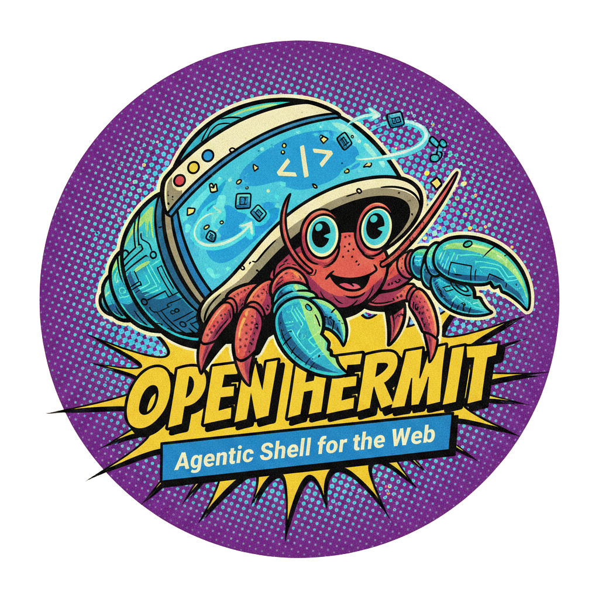

<div align="center">
  

# OpenHermit.js

**Make any website discoverable and actionable by AI agents.**
</div>

OpenHermit automatically injects [WebMCP](https://webmachinelearning.github.io/webmcp/) (W3C Web Model Context Protocol) attributes into your website's forms and actions, making them instantly discoverable by AI agents like ChatGPT, Claude, and custom AI tools.

Like a hermit crab finding the perfect shell — instant, automatic, perfect.

[](https://opensource.org/licenses/MIT)
[](https://www.npmjs.com/package/@openhermit/js)

## Features

- 🦀 **Automatic WebMCP injection** - Detects forms, calculators, booking widgets
- 🤖 **AI agent tracking** - Know which agents visit and what they do
- 🎯 **Zero configuration** - Works out of the box
- 🔧 **Customizable** - Configure agent prompts and behavior
- 📊 **Real-time analytics** - Dashboard at [openhermit.com](https://www.openhermit.com)
- 🔌 **Dual API support** - Both Declarative (HTML attributes) and Imperative (`registerTool`) WebMCP APIs
- 🚀 **Lightweight** - Vanilla JavaScript, zero dependencies

## Quick Start

### 1. Get your API key

Sign up at [openhermit.com](https://www.openhermit.com) to get your free API key.

### 2. Add the script to your website

```html
<script
  src="https://cdn.openhermit.com/v1/openhermit.js"
  data-api-key="your-api-key-here"
  async
></script>
```

That's it! Your website is now agent-ready.

## Installation Methods

### CDN (Recommended)

```html
<script
  src="https://cdn.openhermit.com/v1/openhermit.js"
  data-api-key="YOUR_API_KEY"
  async
></script>
```

### NPM

```bash
npm install @openhermit/js
```

```javascript
import OpenHermit from '@openhermit/js';

OpenHermit.init({
  apiKey: 'YOUR_API_KEY',
  apiBase: 'https://www.openhermit.com' // optional
});
```

### Self-Hosted

Download `src/openhermit.js` and host it yourself:

```html
<script
  src="/path/to/openhermit.js"
  data-api-key="YOUR_API_KEY"
  data-api-base="https://your-api.com" // optional
  async
></script>
```

## Configuration

### Script Attributes

| Attribute | Required | Description |
|-----------|----------|-------------|
| `data-api-key` | Yes | Your OpenHermit API key |
| `data-api-base` | No | Custom API endpoint (default: `https://www.openhermit.com`) |

### Custom API Base

If you're self-hosting the OpenHermit platform:

```html
<script
  src="https://cdn.openhermit.com/v1/openhermit.js"
  data-api-key="YOUR_API_KEY"
  data-api-base="https://your-custom-api.com"
  async
></script>
```

## What It Does

OpenHermit automatically:

1. **Detects forms** - Contact forms, signups, newsletters, bookings, etc.
2. **Injects WebMCP Declarative attributes** - Adds `toolname`, `tooldescription`, `toolparamdescription` (W3C spec) plus `data-mcp-action`, `data-mcp-description`, `data-mcp-params` (backward compat)
3. **Registers Imperative tools** - Calls `navigator.modelContext.registerTool()` with AbortSignal-based lifecycle (Chrome 148+)
4. **Detects third-party widgets** - Calendly, Typeform, HubSpot, Intercom
5. **Extracts business info** - Phone, email, address from Schema.org or page content
6. **Tracks agent interactions** - Knows when AI agents visit and what they do, including `SubmitEvent.agentInvoked` and `toolactivated`/`toolcancel` browser events
7. **Serves manifest** - Provides WebMCP-compliant manifest at `/api/manifest`

## Supported AI Agents

OpenHermit detects and tracks:

- ChatGPT (GPTBot, ChatGPT-User)
- Claude (ClaudeBot, Claude-Web)
- Perplexity (PerplexityBot)
- Google Gemini (Google-Extended)
- Microsoft Copilot
- OpenAI Operator
- Custom agents via user-agent detection

## Examples

### Basic HTML

```html
<!DOCTYPE html>
<html>
<head>
  <title>My Website</title>
</head>
<body>
  <form action="/contact" method="POST">
    <input type="email" name="email" required>
    <textarea name="message" required></textarea>
    <button type="submit">Send</button>
  </form>

  <!-- OpenHermit will automatically detect this form and inject WebMCP attributes -->

  <script
    src="https://cdn.openhermit.com/v1/openhermit.js"
    data-api-key="YOUR_API_KEY"
    async
  ></script>
</body>
</html>
```

### React

```jsx
import { useEffect } from 'react';

function App() {
  useEffect(() => {
    const script = document.createElement('script');
    script.src = 'https://cdn.openhermit.com/v1/openhermit.js';
    script.setAttribute('data-api-key', 'YOUR_API_KEY');
    script.async = true;
    document.head.appendChild(script);
  }, []);

  return (
    <form action="/contact" method="POST">
      <input type="email" name="email" required />
      <textarea name="message" required />
      <button type="submit">Send</button>
    </form>
  );
}
```

### Next.js

```jsx
// app/layout.js
export default function RootLayout({ children }) {
  return (
    <html>
      <head>
        <script
          src="https://cdn.openhermit.com/v1/openhermit.js"
          data-api-key={process.env.NEXT_PUBLIC_OPENHERMIT_KEY}
          async
        />
      </head>
      <body>{children}</body>
    </html>
  );
}
```

### WordPress

Add to your theme's `footer.php` or use a plugin like "Insert Headers and Footers":

```html
<script
  src="https://cdn.openhermit.com/v1/openhermit.js"
  data-api-key="YOUR_API_KEY"
  async
></script>
```

## Browser Compatibility

OpenHermit uses vanilla ES5 JavaScript and works on:

- ✅ Chrome/Edge (all versions)
- ✅ Firefox (all versions)
- ✅ Safari (all versions)
- ✅ IE 11+ (yes, really)
- ✅ Mobile browsers

## Privacy & Security

- **No PII collected** - Only tracks agent interactions, not user data
- **No cookies** - Fully cookieless tracking
- **No external dependencies** - Self-contained script
- **Open source** - Inspect the code yourself
- **Fail-safe** - Never breaks your website (wrapped in try/catch)

## Development

### Build from source

```bash
git clone https://github.com/openhermit/openhermit-js.git
cd openhermit-js
npm install
npm run build
```

### Run tests

```bash
npm test
```

## WebMCP Specification

OpenHermit implements the [W3C Web Model Context Protocol (WebMCP)](https://webmachinelearning.github.io/webmcp/) specification for AI agent discoverability. WebMCP is an emerging W3C standard that defines how websites expose actions and capabilities to AI agents through the `navigator.modelContext` browser API and HTML data attributes.

### Declarative API

OpenHermit injects W3C-compliant HTML attributes on detected forms:

```html
<form
  toolname="submit_contact_form"
  tooldescription="Submit a contact form inquiry to the business"
  data-openhermit="true"
>
  <input type="email" name="email" toolparamdescription="Your email address" required />
  <textarea name="message" toolparamdescription="Your message" required></textarea>
  <button type="submit">Send</button>
</form>
```

### Imperative API

On browsers that support `navigator.modelContext` (Chrome 146+ with flag), OpenHermit also registers tools programmatically using the AbortSignal pattern (Chrome 148+):

```javascript
// OpenHermit does this automatically for each detected form:
const controller = new AbortController();
navigator.modelContext.registerTool({
  name: "submit_contact_form",
  description: "Submit a contact form inquiry to the business",
  inputSchema: {
    type: "object",
    properties: {
      email: { type: "string", format: "email", description: "Your email address" },
      message: { type: "string", description: "Your message" }
    },
    required: ["email", "message"]
  },
  execute: (params) => { /* fills and submits the form */ }
}, { signal: controller.signal });

// Tool is unregistered when the AbortController is aborted
// (e.g., during SPA re-scans or page cleanup)
controller.abort();
```

### Browser Events

OpenHermit also listens for and tracks WebMCP browser events:

- `toolactivated` — fired when an AI agent invokes a tool and populates form fields
- `toolcancel` — fired when an agent or user cancels a tool invocation
- `SubmitEvent.agentInvoked` — boolean indicating whether a form submit was agent-triggered

## Dashboard & Analytics

Get real-time insights at [openhermit.com](https://www.openhermit.com):

- Which AI agents visit your site
- What forms/actions they interact with
- Conversion rates and success metrics
- Custom agent prompts and behavior controls

## Contributing

We welcome contributions! Please see [CONTRIBUTING.md](CONTRIBUTING.md) for guidelines.

## Community & Support

- [Discord](https://discord.com/invite/FQQg2GBQ) — Chat, get help, share what you're building
- [Documentation](https://docs.openhermit.com)
- [Report Issues](https://github.com/openhermit/openhermit-js/issues)

## License

MIT License - see [LICENSE](LICENSE) for details.

## Links

- [Website](https://www.openhermit.com)
- [Documentation](https://docs.openhermit.com)
- [GitHub](https://github.com/openhermit)
- [npm Package](https://www.npmjs.com/package/@openhermit/js)

---

Developed by [loaded.ch](https://loaded.ch) | Powered by [OpenHermit](https://www.openhermit.com)
